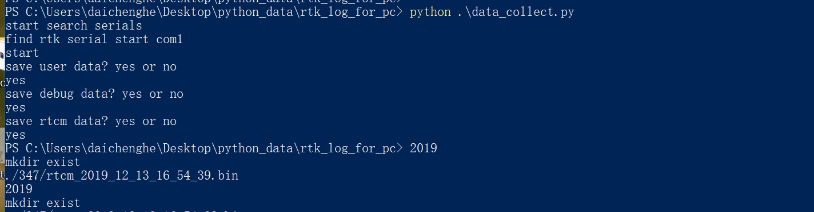

# rtk log for pc V1.00

> development environment: python  
> script running environment: PC

**1. run cmd: python ./data_collect.py**
**2. select whether to record RTCM, user, and debug data according to the prompts**
 
3.  data_collect.py will auto search rtk serial port and start the appropriate script to collect data   
